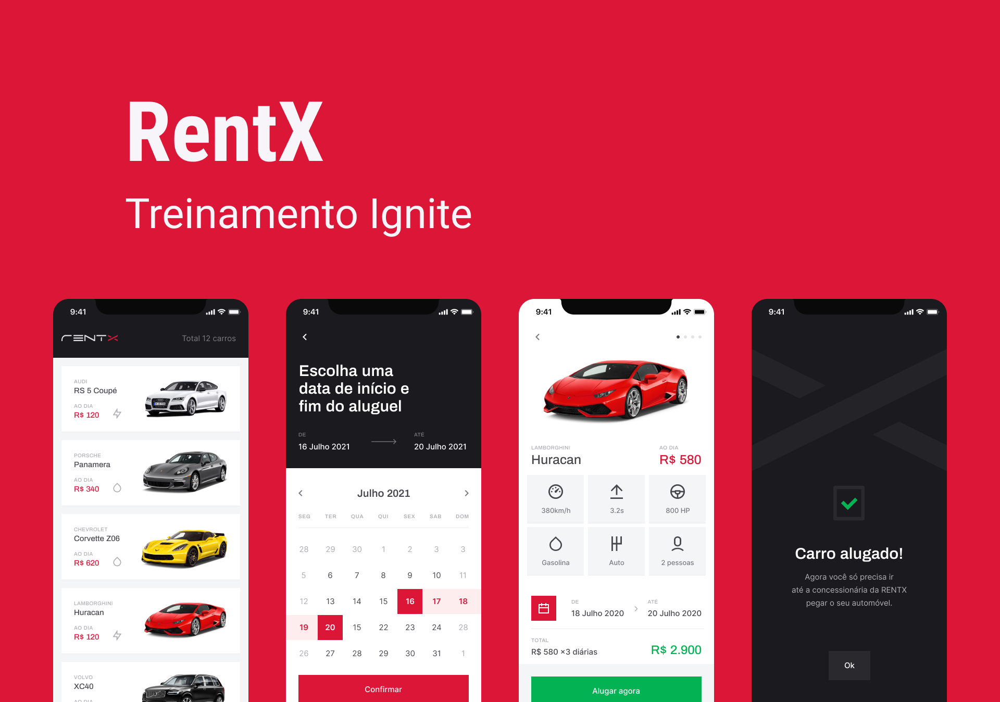

# Rentx (Aplicação mobile para aluguel de carros)

## Capa
 <br/> <br/>

## Funcionalidades da aplicação
- Listagem de carros disponíveis para aluguel
- Alugar carros
- Listar agendamentos do usuário
- Mostrar detalhes dos carros

## Tecnologias utilizadas
- React Native
- Typescript
- Expo
- Styled components
- React-native-calendars
- Stack Navigator
- Json-server
- Axios
- Date-fns
- React-native-reanimated

## Principais aprendizados
- Utilizar calendários
- Trabalhar com datas
- Heurísticas de Nielsen e UX (User experience)
- Consumir API
- Animações
- Transições (Bezier: https://cubic-bezier.com/#.17,.67,.83,.67)
- Lidar com gestos do usuário
- Splash screen animada
- Acessibilidade em formulários

## Design da aplicação
- Clique [aqui](https://www.figma.com/file/e8Kkb8QImQV0Z0F8WXkgju/RentX-Ignite---Offline-First?node-id=0%3A1) para acessar o layout no Figma

## Como executar a aplicação 
### Pré-requisitos
* yarn
```bash
npm install --global yarn
```
* expo
```bash
npm install -g expo-cli
```

### Instalação
1. Clone o repositório
```bash
git clone https://github.com/jvolima/rentx-mobile.git
```
2. Acesse a pasta do projeto
```bash
cd rentx-mobile
```
3. Instale as dependências necessárias 
```bash
yarn
```
4. Execute o projeto
```bash
expo start
```
